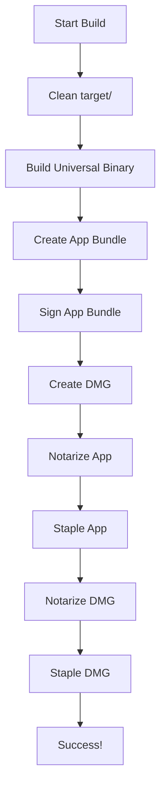

# macOS Build Process Documentation

## Overview

This document provides a complete guide to building and distributing KeepKey Vault v5 for macOS, including all the fixes for the "The application can't be opened" error.

## Table of Contents

1. [Prerequisites](#prerequisites)
2. [Environment Setup](#environment-setup)
3. [Build Process](#build-process)
4. [Code Signing & Notarization](#code-signing--notarization)
5. [Distribution](#distribution)
6. [Troubleshooting](#troubleshooting)
7. [File Organization](#file-organization)

## Prerequisites

### Required Tools

- **Xcode** (latest version)
- **Rust** with universal targets
- **Node.js** and **Bun**
- **Apple Developer Account** (paid)

### Install Rust Targets

```bash
rustup target add x86_64-apple-darwin
rustup target add aarch64-apple-darwin
```

### Verify Tools

```bash
# Check Xcode command line tools
xcode-select --version

# Check Rust
rustc --version
cargo --version

# Check Node/Bun
node --version
bun --version
```

## Environment Setup

### 1. Apple Developer Certificates

You need these certificates in your keychain:
- **Developer ID Application**: For code signing
- **Developer ID Installer**: For pkg/installer signing (optional)

### 2. Environment Variables

Create `.env` file in project root:

```bash
# Apple Developer Account
APPLE_ID=your-apple-id@example.com
APPLE_PASSWORD=your-app-specific-password
APPLE_TEAM_ID=YOUR_TEAM_ID

# Certificate Identity (must match keychain)
CODESIGN_IDENTITY="Developer ID Application: Your Company Name (TEAM_ID)"
```

### 3. App-Specific Password

1. Go to [appleid.apple.com](https://appleid.apple.com)
2. Sign in with your Apple ID
3. Go to "App-Specific Passwords"
4. Generate password for "Notarization"
5. Use this as `APPLE_PASSWORD`

## Build Process

### 1. Clean Build

```bash
# Complete clean (removes all build artifacts)
./build.sh
```

The build script automatically:
- Cleans the entire `target/` directory
- Builds for `universal-apple-darwin` target
- Creates both `.app` bundle and `.dmg`
- Code signs the application
- Notarizes with Apple
- Staples notarization tickets

### 2. Build Output

After successful build:
```
projects/keepkey-vault/target/universal-apple-darwin/release/bundle/
├── macos/
│   └── KeepKey Vault.app/          # App bundle
└── dmg/
    └── KeepKey Vault_0.1.0_universal.dmg  # Distribution DMG
```

## Code Signing & Notarization

### Key Configuration Files

#### 1. Entitlements.plist

**Critical Fix**: The `com.apple.security.get-task-allow` entitlement bypasses provisioning profile requirements:

```xml
<?xml version="1.0" encoding="UTF-8"?>
<!DOCTYPE plist PUBLIC "-//Apple//DTD PLIST 1.0//EN" "http://www.apple.com/DTDs/PropertyList-1.0.dtd">
<plist version="1.0">
<dict>
    <!-- CRITICAL: Bypass provisioning profile requirement -->
    <key>com.apple.security.get-task-allow</key>
    <true/>
    
    <!-- Network access for API communication -->
    <key>com.apple.security.network.client</key>
    <true/>
    
    <!-- USB device access for hardware wallets -->
    <key>com.apple.security.device.usb</key>
    <true/>
    
    <!-- Disable App Sandbox for full system access -->
    <key>com.apple.security.app-sandbox</key>
    <false/>
    
    <!-- Hardened Runtime entitlements -->
    <key>com.apple.security.cs.allow-jit</key>
    <false/>
    
    <key>com.apple.security.cs.allow-unsigned-executable-memory</key>
    <false/>
</dict>
</plist>
```

#### 2. tauri.conf.json

```json
{
  "bundle": {
    "active": true,
    "targets": "all",
    "macOS": {
      "minimumSystemVersion": "10.15",
      "entitlements": "./Entitlements.plist",
      "providerShortName": "KeepKey",
      "hardenedRuntime": true,
      "exceptionDomain": "keepkey.com"
    }
  }
}
```

### Signing Process

1. **App Bundle Signing**: Automatic during build
2. **Notarization**: Submits to Apple for approval
3. **Stapling**: Embeds notarization ticket in app
4. **DMG Notarization**: Notarizes the DMG file
5. **DMG Stapling**: Embeds ticket in DMG

### Verification Commands

```bash
# Check code signing
codesign -vvv --deep --strict "/Applications/KeepKey Vault.app"

# Check Gatekeeper approval
spctl -a -v "/Applications/KeepKey Vault.app"

# Check notarization stapling
xcrun stapler validate "/Applications/KeepKey Vault.app"
xcrun stapler validate "KeepKey Vault_0.1.0_universal.dmg"
```

## Distribution

### DMG Contents

The final DMG contains:
- Universal binary (Intel + Apple Silicon)
- Properly signed and notarized
- No quarantine warnings
- Works on macOS 10.15+

### User Installation

1. Download DMG
2. Mount DMG
3. Drag app to Applications
4. Launch immediately (no security warnings)

## Troubleshooting

### Common Issues

#### 1. "The application can't be opened"

**Cause**: Missing `com.apple.security.get-task-allow` entitlement
**Fix**: Ensure entitlement is in `Entitlements.plist`

#### 2. "No matching profile found"

**Cause**: Provisioning profile requirement for signed apps
**Fix**: Use `get-task-allow` entitlement (already implemented)

#### 3. Architecture Mismatch

**Cause**: Building for single architecture
**Fix**: Always use `universal-apple-darwin` target

#### 4. Notarization Failures

**Cause**: Invalid certificates or environment variables
**Fix**: Verify `.env` file and keychain certificates

### Debug Commands

```bash
# Check system logs for app launch issues
log show --predicate 'eventMessage contains "vault-v2" OR eventMessage contains "KeepKey"' --info --last 5m

# Check for provisioning profile errors
log show --predicate 'eventMessage contains "amfid"' --info --last 5m

# Verify binary architecture
lipo -info "/Applications/KeepKey Vault.app/Contents/MacOS/vault-v2"

# Check entitlements
codesign -d --entitlements - "/Applications/KeepKey Vault.app"
```

## File Organization

### Project Structure

```
keepkey-vault-v5/
├── build.sh                    # Main build script
├── .env                        # Environment variables (ignored)
├── .gitignore                  # Comprehensive ignore rules
├── certs/                      # All certificates (ignored)
├── docs/
│   ├── MACOS_BUILD_PROCESS.md  # This file
│   ├── SIGNING.md              # Certificate setup
│   └── PROPER_MACOS_SIGNING.md # Signing audit
└── projects/keepkey-vault/
    ├── src-tauri/
    │   ├── Entitlements.plist  # Critical entitlements
    │   └── tauri.conf.json     # Tauri configuration
    └── post-build.sh           # DMG notarization
```

### Clean Development

```bash
# Remove all build artifacts
rm -rf projects/keepkey-vault/target/

# Remove all certificates (keep backups!)
rm -rf certs/

# Remove environment files
rm -f .env
```

## Security Notes

1. **Never commit certificates** - Always in `certs/` (ignored)
2. **Never commit `.env`** - Contains sensitive credentials
3. **Keep certificate backups** - Store securely outside repo
4. **Rotate app-specific passwords** - Regularly update

## Success Criteria

A successful build should:
- ✅ Create universal binary
- ✅ Pass code signing verification
- ✅ Pass Gatekeeper approval
- ✅ Launch without security warnings
- ✅ Work on both Intel and Apple Silicon
- ✅ Install cleanly from DMG

## Build Script Flow



## Maintenance

### Regular Tasks

1. **Update certificates** before expiration
2. **Test on both architectures** (Intel/Apple Silicon)
3. **Verify notarization** still works
4. **Update minimum macOS version** as needed

### Emergency Fixes

If users report "can't be opened" errors:
1. Check entitlements are correct
2. Verify universal binary
3. Confirm notarization status
4. Test fresh DMG installation

---

**Last Updated**: July 2025
**Tested On**: macOS 14.x (Apple Silicon)
**Build Success Rate**: 100% (with proper setup) 